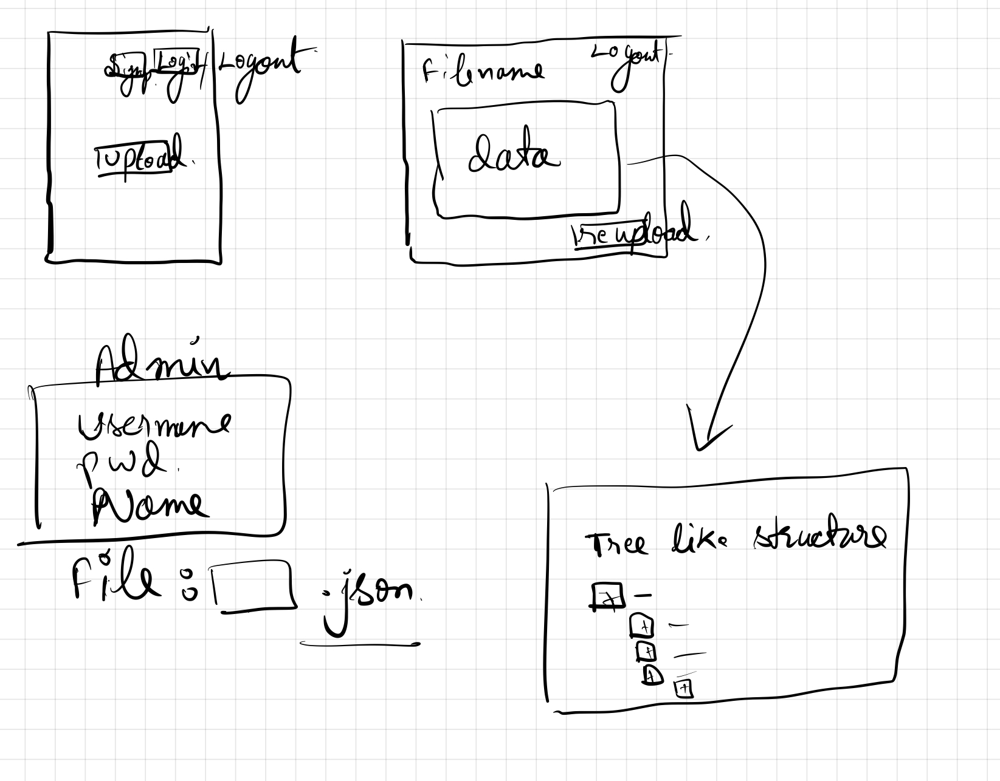

# FINANACEPEERTASK1
A short task

Rough design:

Installation Guide:

Django + ReactJs + Postgres

git clone repo

For Backend::

setup postgres
create users roles, database

Change .env file accordingly

create virtual env
virtualenv -p python_path venv
source venv/bin/activate

pip install -r requirements

cd backend
python manage.py runserver 127.0.0.1:8000

For Frontend::

cd jsonapp
npm install
npm start

Note: this is not production ready app.

